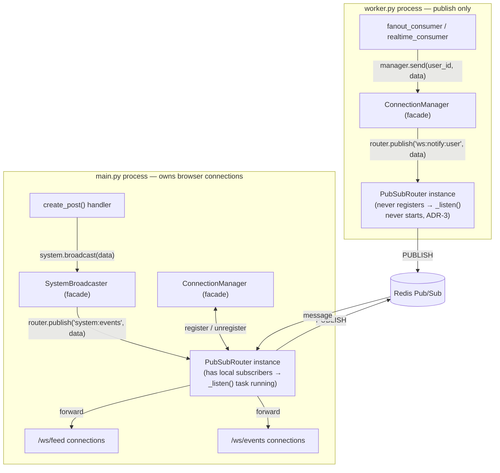

# Milestone 7.5 — Cross-Process Event Infrastructure

## FanoutFeed · `milestone-7.5-cross-process-events`

---

## Goal

Answer one architectural question directly: how should any process in
this system publish events that ultimately reach browser clients,
regardless of which process generated them? Not "fix SystemBroadcaster"
— identify and build the shared abstraction underneath both existing
mechanisms.

---

## How this was discovered

Not felt-pain-driven in the usual sense — discovered while manually
verifying Milestone 7's new `FANOUT_HEAVY` debug event. It never
appeared in the browser's EventLog. Root cause: `SystemBroadcaster` has
been a per-process in-memory client list since Milestone 3 — an
explicitly accepted limitation at the time. Milestone 4 then moved
`fanout_consumer`/`realtime_consumer` into a fully separate `worker.py`
process, which made that limitation concrete: every `system.broadcast()`
call from inside a consumer has been reaching zero browser clients,
silently, since M4. `POST_CREATED` was the only event ever visible in
the browser, because it's the only one broadcast from inside `app.py` —
the same process that serves `/ws/events`.

---

## Architecture



Two independent `PubSubRouter` instances — one per process, no shared
in-process state — connected only through Redis. `worker.py`'s instance
never calls `register()`, so its listener never starts (ADR-3);
`main.py`'s instance is the only one with local WebSocket clients, so
it's the only one that ever forwards anything.

---

## Architecture Decision Records

### ADR-1: One shared `PubSubRouter`, not a second bespoke broadcaster

Decision:  
Build a single generic channel-based cross-process router;
ConnectionManager and SystemBroadcaster become thin facades over it.

Reason:
Both are the same operation — deliver a Redis-published message to
zero-or-more locally-held WebSockets under a channel name. A second
bespoke implementation would duplicate the subscribe/unsubscribe/
listen machinery ConnectionManager already got right.

Tradeoffs:

```text
+ One mechanism to test/extend for future workers
+ Retires the M4 identity-guard entirely (ADR-2)
- One more layer of indirection than two single-purpose classes
```

Revisit When:
A future channel needs semantics the generic router can't
express (ordered delivery, per-message acks) — for that
specific need, not as a reason to abandon the shared router
for the other two.

### ADR-2: Channels track a Set[WebSocket], not a single slot

Decision:  
channel -> Set[WebSocket], supporting multiple simultaneous
local connections per channel.

Reason:  
The M4 identity-guard existed only because the old design used
one dict slot per user, forcing canonical-connection arbitration
on a second tab. A set removes the ambiguity structurally.

Behavior change (explicit):
A user with two open tabs now receives a
push on both, not just the most recently connected one.

Tradeoffs:

```text
+ Eliminates a documented historical bug class entirely
+ More intuitive multi-tab behavior
- Trivially more memory per channel (meaningless at this scale)
```

Revisit When:
A future requirement specifically wants "newest connection
wins" (e.g., enforced single-active-session).

### ADR-3: Lazy listener startup for publish-only processes

Decision:  
init() only creates a publish-capable client; the subscribe
connection, keepalive channel, and _listen() task are created
lazily on the first register() call.

Reason:  
Resolves worker.py's standing docstring note about "unused
overhead" — a process that only ever publishes (worker.py) now
genuinely never runs a listener loop or holds a pubsub
subscription it doesn't need.

Tradeoffs:

```text
+ Zero listener overhead for publish-only processes
- Slightly more init-path branching than eager setup
```

Revisit When:
Not really — strict improvement for our usage shape.

### ADR-4: PubSubRouter bundles transport, subscriptions, registry, and forwarding as one class

Decision:
These four responsibilities are NOT split into separate
Transport / SubscriptionManager / ChannelRegistry classes.

Reason:  
All four exist solely to enforce one invariant: a channel is
subscribed at the Redis level IFF it has >=1 local subscriber.
Splitting would require a coordinator to keep that invariant
consistent across objects — real complexity for a separation
with no current concrete beneficiary. Exactly one transport,
one delivery mechanism, one subscription model exists today —
no second implementation of any sub-piece to justify a boundary.

Tradeoffs:

```text
+ One place to reason about "how does a published message
reach local sockets," invariant enforced atomically
- Not unit-testable without a real (or network-faked) Redis
```

Revisit When:
(a) we need to unit-test registry/forwarding logic without
a live Redis — a thin Transport interface would earn its
cost then; or (b) we need pattern/sharded subscribe
semantics genuinely different from plain channel subscribe.

### ADR-5: PubSubRouter is mechanism; ConnectionManager/SystemBroadcaster are policy

Decision:
PubSubRouter is domain-agnostic; ConnectionManager and
SystemBroadcaster are policy/domain layers built on top of it.

Reason:  
ConnectionManager owns real state (is_online/_local_users) and
real domain meaning (user_id -> channel) that doesn't reduce to
anything the router tracks. This is a mechanism/policy split,
not "wrap the router in a class per feature." SystemBroadcaster
is the honest exception: after this refactor it carries no
state of its own, and is kept specifically for call-site
readability and as a future extension seam — not because it's
a domain object in the same sense ConnectionManager is. Worth
being explicit about that downgrade rather than implying
continuity that isn't there.

Tradeoffs:

```text
+ Future auth/policy work has one obvious owner
(ConnectionManager)
+ Router stays reusable for non-user-shaped channels
```

Revisit When:
No trigger identified for the mechanism/policy split
itself — stable by design. SystemBroadcaster specifically:
revisit if it never gains any logic beyond pass-through,
at which point inlining router.publish("system:events", ...)
at call sites becomes worth reconsidering.

### ADR-6: PubSubRouter is scoped to WebSocket delivery, not general messaging

Decision:
PubSubRouter is not a general-purpose Redis messaging
primitive. It exists solely to deliver messages to
locally-registered WebSocket connections, regardless of which
process published them.

Reason:  
Its _listen() loop is hard-wired to ws.send_text() and offers
no durability/replay/ACK semantics. Any future need for those
properties already has a home: event_bus.py's Redis Streams.

Tradeoffs:

```text
+ Keeps the router's contract small and predictable
- A future generic-messaging need must NOT reach for this
class, even though it would superficially "already work"
```

Revisit When:
Never, by design. A future need for non-WS cross-process
messaging should get its own primitive, not extend this one.

---

## What was built

### New files

```text
app/ws_router.py       — PubSubRouter, generic cross-process WS delivery
test_pubsub_router.py  — two-instance cross-process verification
```

### Modified files

```text
app/ws_manager.py — ConnectionManager + SystemBroadcaster rewritten as
                    thin facades over the shared router; identity-guard
                    removed entirely (ADR-2)
app/app.py        — lifespan inits/closes the shared router directly;
                    both WS route handlers await the now-async
                    disconnect() calls
worker.py         — inits/closes the shared router instead of calling
                    manager.init()/close(); docstring's "unused
                    overhead" note resolved by ADR-3, updated to say so
```

### Unchanged

`consumers.py`, `event_bus.py`, `db.py`, `cache.py`, all frontend files —
confirms the goal that producers (fanout_consumer, realtime_consumer,
create_post) never needed to change at all.

---

## Verification

- **`test_pubsub_router.py`**: all 4 phases passed against two independent
  `PubSubRouter` instances (simulating separate processes, each with its
  own Redis connection) — cross-process delivery from a router with zero
  local subscribers, multi-subscriber fan-out to two WebSockets on the
  same channel, precise unregistration (removing one subscriber doesn't
  affect another), and a safe no-op when publishing to a channel with no
  subscribers anywhere.
- **Manual, `worker.py` + `main.py` running as genuinely separate
  processes**: followed enough test accounts to push one over
  `HEAVY_FANOUT_THRESHOLD`, posted as that account, and confirmed
  `FANOUT_HEAVY` (👑) now appears in the browser's `/ws/events` EventLog —
  the specific event that motivated this milestone, now correctly
  crossing the process boundary via Redis Pub/Sub instead of vanishing
  into `worker.py`'s empty local client list.
- **Manual, two browser tabs, same logged-in user**: both tabs received
  the `NEW_POST` push for a newly created post — confirms ADR-2's
  explicit behavior change (Set-based channel membership) is working as
  designed, not just passing in isolation.

---

## Known limitations

- **`realtime_consumer` still has an O(followers) push loop** —
  unaffected by this milestone. Unifying the *transport* doesn't touch
  this, because it isn't a routing problem — it's a write-amplification
  problem, structurally identical to what M7 fixed for timeline writes,
  just for push notifications instead. There's no "read-time merge"
  equivalent for a WebSocket push — you can't retroactively deliver one.
  Needs its own design, deferred again, now for a clearer reason: it's a
  different *kind* of problem than the one this milestone solves.
- **Multi-tab delivery is a real, if minor, behavior change** (ADR-2) —
  worth remembering if a future feature ever wants "only the newest tab
  should receive pushes" semantics.

---

## Next milestone

Return to the original roadmap: **Milestone 8 — Persistent notification
store.** Also worth reconsidering at that point whether `realtime_consumer`'s
O(followers) push loop should be addressed alongside it, since a
persistent store changes what "notify a follower" even means (a DB write
plus an optional live push, rather than only a live push).

